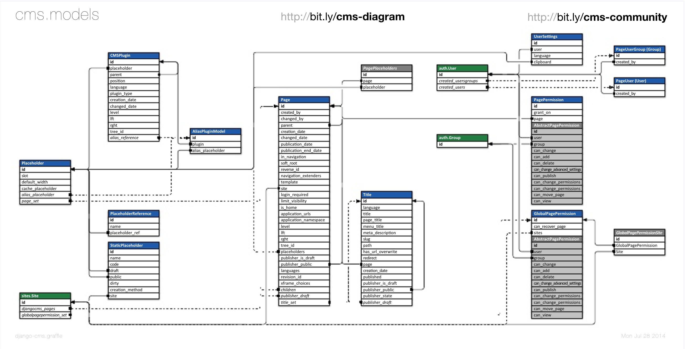
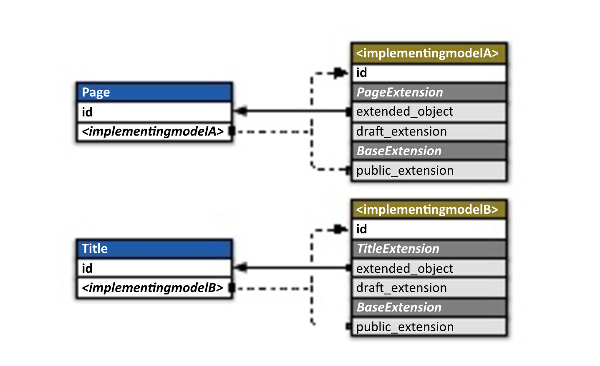
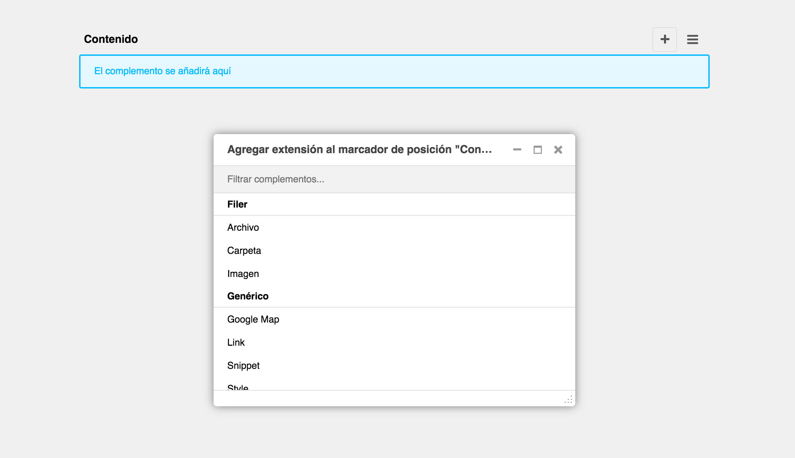
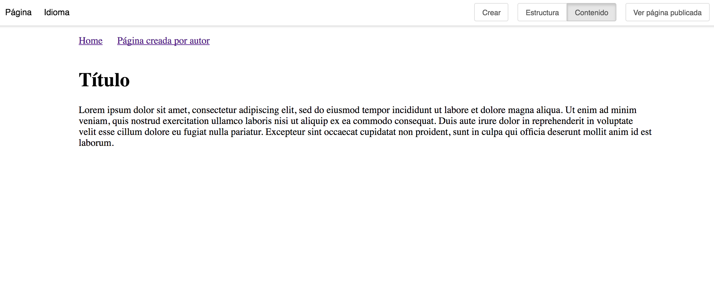

# Páginas

* Una Página es la entidad más básica de la estructura del sitio en django CMS.

* El CMS utiliza un modelo **jerárquico** de la página: cada página está en relación con otras páginas (padre, hijo o hermano). Esta jerarquía es administrada por la librería [django-treebeard](http://django-treebeard.readthedocs.io/en/latest/).

* Las páginas son **traducibles** por lo tanto una Página también tiene propiedades específicas de idioma (tendrá un título y un slug para cada idioma en el que existe). Estas propiedades son gestionadas por el modelo `cms.models.Title`

* Están basadas en **plantillas**.

* Tienen versiones **Borrador y publicada**

## Estructura y contenido

A la hora de editar una página, en la parte derecha del toolbar de gestión nos encontraremos con dos botones: estructura y contenido.

### Estructura

En la parte de estructura veremos los distintos placeholders que componen la página y podremos ir incluyendo plugins  dentro de ellos.

Además de añadir plugins, podemos moverlos, copiarlos así como añadir plugins anidados.

### Contenido

Dentro de la pestaña de contenido en la parte de edición podremos ver cómo queda la página y haciendo doble click sobre los distintos plugins podemos modificar el contenido (texto, imagen, etc).

## Borrador & público

Cáda página que creemos en el CMS tendrá dos versiones una pública y otra borrador.

## Internacionalización

Una página podrá tener distintas traducciones.

Cuando vayamos a crear la traducción de una página ya creada podremos copiar todos los plugins que tenga la página en el idioma que ya está editado.

