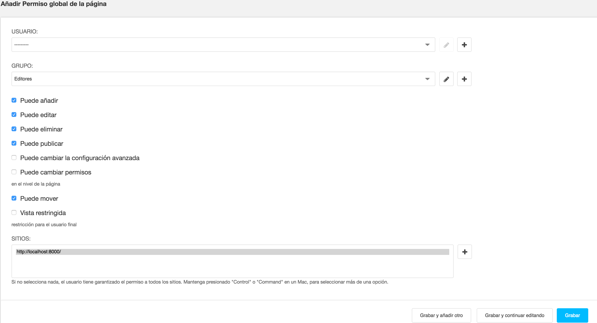
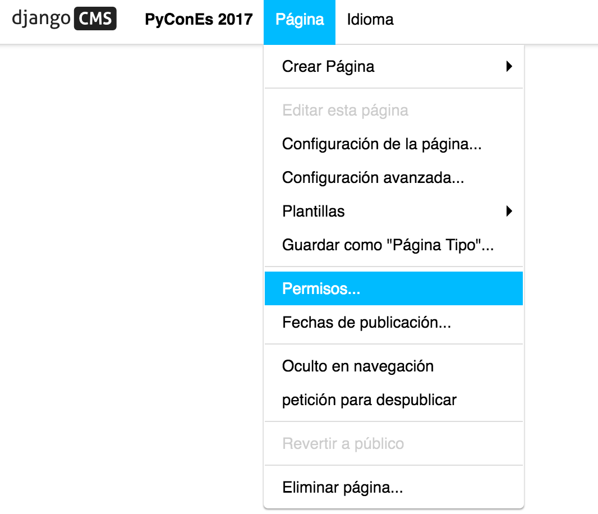
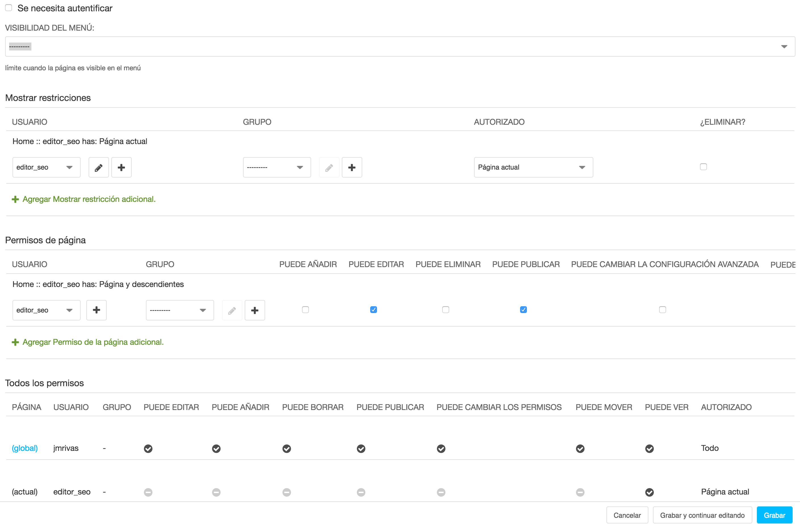

# Permisos

En django CMS tenemos la posibilidad de habilitar un sistema de permisos propio. Se pueden conceder permisos:

* Que determinan qué acciones puede realizar un usuario.
* Que determinan en qué partes del sitio pueden realizarlas.

Estas dos dimensiones de los permisos son independientes entre sí.

Para activar este sistema debemos seleccionar en el fichero settings.py del proyecto la variable CMS_PERMISSION a True, sin embargo si decidimos no habilitarlo lo pondremos a False y el sistema de permisos que prevalecerá será el estándar django. Por defecto CMS_PERMISSION será habilitado:

`CMS_PERMISSION = TRUE`

Cuando CMS_PERMISSION está habilitado, encontrará tres nuevos modelos disponibles en el administrador:

* Permisos globales de las páginas
* Grupos de usuarios (página)
* Usuarios (página)

Descubrirá que estos dos últimos simplemente reflejan los Grupos Django y los permisos de Usuario que ya existen en el sistema. Son una representación más simple de los permisos disponibles, específicos para la edición de páginas. A menudo encontrará más útil utilizar los grupos Django y los permisos de usuario.

## Permisos de página

Cuando CMS_PERMISSION está habilitado, a menos que simplemente hagamos que los usuarios sean superusuarios, necesitaremos dar a cada uno de ellos un permiso global o permiso sobre páginas específicas (preferiblemente a través de su pertenencia a un grupo).

Tanto la concesión de permisos globales como específicos se describen a continuación.

### Permisos de páginas globales

Los permisos globales de las páginas están disponibles en la sección django CMS del administrador.

Las dos primeras opciones para un permiso global se refieren a quiénes solicitan.

A continuación, se muestra una lista de las acciones que puede realizar el editor. Los editores necesitarán al menos algunos de estos si van a administrar páginas.

Finalmente, hay una lista de los sitios en los que pueden realizar las acciones.

### Permisos específicos de página

El sistema de permisos CMS también proporciona el control de permisos para páginas o jerarquías de páginas.

Éstas se controlan seleccionando _Permisos_ desde el menú de Página en la barra de herramientas cuando se encuentra en la página (esta opción sólo está disponible cuando el modo CMS_PERMISSION está activado).

El inicio de sesión requerido determina si los visitantes anónimos podrán ver la página en absoluto.

La visibilidad de los menús determina quién podrá ver la página en los menús de navegación: todos, sólo usuarios anónimos o que hayan iniciado sesión.

Las restricciones de visualización determinan qué grupos y usuarios podrán ver la página.

Tenga en cuenta que esto no aplica nuevas restricciones a los usuarios que también son editores con permisos apropiados.

Los permisos de página determinan lo que los editores pueden hacer a una página (o jerarquía de páginas). Funcionan igual que los permisos globales de las Páginas descritos anteriormente, pero no se aplican globalmente. Se añaden a los permisos globales - no los anulan.

