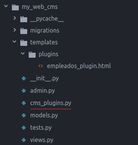

# Plugins

En la página **sobre_nosotros** nos habíamos quedado en el apartado "conoce a nuestro equipo". Este apartado es muy propicio para introducir los **custom plugins** de django CMS.

Los CMS Plugins son contenidos reutilizables que pueden ser insertados en las páginas CMS de django (o en cualquier contenido que utilice los placeholders de django CMS). Permiten la publicación automática de la información, sin necesidad de intervención adicional.

## ¿Por qué necesitas escribir un plugin?

Los plugins son la forma más conveniente de integrar contenido de otra aplicación de Django en una página CMS de django.

Por ejemplo, suponga que está desarrollando un sitio para una compañía discográfica en django CMS. Puede querer tener un cuadro de "Últimos lanzamientos" en la página principal de su sitio.

Por supuesto, cada cierto tiempo podías editar esa página y actualizar la información. Sin embargo, una compañía discográfica sensata también gestionará su catálogo en Django, lo que significa que Django ya sabe cuáles son las novedades de esta semana.

Esta es una excelente oportunidad para hacer uso de esa información para hacer su vida más fácil - todo lo que necesita hacer es crear un plugin de CMS django que puede insertar en su página de inicio, y dejar que haga el trabajo de publicar información sobre las últimas versiones.

Los plugins son reutilizables. Tal vez su compañía discográfica está produciendo una serie de reediciones de discos de carnaval semanales... en la página de su sitio web sobre la serie, podría insertar el mismo plugin, configurado de forma un poco diferente, que publicará información sobre los nuevos lanzamientos recientes de esa serie.

## Versión rápida
Un plugin de django CMS está compuesto fundamentalmente de tres cosas.

* un plugin editor, para configurar un plugin cada vez que se despliega
* un plugin publisher, para hacer el trabajo automatizado de decidir qué publicar
* un plugin template, para convertir la información en una página web

Estos corresponden al esquema de Modelo-Vista-Controlador que ya conocemos:

* El modelo de plugin para almacenar su configuración
* La vista de plugin que resuelve lo que necesita ser visualizado
* La plantilla de plugin para renderizar la información

Y para construir tu plugin, lo harás a partir de:

* Una subclase de modelos `cms.pluginmodel.CMSPlugin` para almacenar la configuración de las instancias de plugins
* Una subclase de `cms.plugin_base.CMSPluginBase` que define la lógica de su plugin
* Una plantilla que muestra su plugin

# Pasos a seguir para crear nuesto plugins de Empleados

Primero vamos a crear una nueva app django en nuestro proyecto dónde vamos a gestionar estos plugins:

`python manage.py startapp my_web_cms`

Seguidamente vamos a crear nuestro modelo de plugin en el fichero `models.py`:

~~~
from django.db import models
from filer.fields.image import FilerImageField
from cms.models.pluginmodel import CMSPlugin
from django.utils.translation import ugettext_lazy as _

class EmpleadosPluginModel(CMSPlugin):
    titulo = models.CharField(max_length=50)

    def copy_relations(self, oldinstance):
        # Before copying related objects from the old instance, the ones
        # on the current one need to be deleted. Otherwise, duplicates may
        # appear on the public version of the page
        self.empleado_item.all().delete()

        for empleado_item in oldinstance.empleado_item.all():
            # instance.pk = None; instance.pk.save() is the slightly odd but
            # standard Django way of copying a saved model instance
            empleado_item.pk = None
            empleado_item.plugin = self
            empleado_item.save()

    def __str__(self):
        return self.titulo

class Empleado(models.Model):
    nombre = models.CharField(
        max_length=250,
        verbose_name=_("Nombre"),
        null=False, blank=False
    )
    apellidos = models.CharField(
        max_length=250,
        verbose_name=_("Apellidos"),
        null=False, blank=False
    )
    cargo = models.CharField(
        max_length=250,
        verbose_name=_("Cargo"),
        null=False, blank=False
    )
    descripcion = models.CharField(
        max_length=250,
        verbose_name=_("Descripción"),
        null=False, blank=False
    )
    twitter = models.URLField(
        verbose_name=_("Usuario de twitter"),
        null=False, blank=True
    )
    email = models.EmailField(
        verbose_name=_("Correo electrónico"),
        null=False, blank=True
    )
    foto = FilerImageField(verbose_name="Foto", null=False, blank=False)
    plugin = models.ForeignKey(
        EmpleadosPluginModel,
        related_name="empleado_item"
    )

    @property
    def nombre_completo(self):
        full_name = "{nombre} {apellidos}".format(nombre=self.nombre, apellidos=self.apellidos)
        return full_name.strip()

    def __str__(self):
        return self.nombre_completo

~~~

El siguiente paso es añadir nuestra app a `INSTALLED_APPS` en el fichero `settings.py` para posteriormente crear y aplicar las migración para este nuevo modelo que hemos creado.

`python manage.py makemigrations`

`python manage.py migrate`

Llegados a este punto ya tenemos nuestro modelo de plugin, hemos cumplido con el paso 1, el siguiente es crear nuestra vista plugin que tenga la lógica. Vamos a crear un fichero **cms_plugins.py** donde estará nuestro plugin:

~~~
from cms.plugin_base import CMSPluginBase
from cms.plugin_pool import plugin_pool
from django.utils.translation import ugettext_lazy as _
from django.contrib import admin
from .models import EmpleadosPluginModel, Empleado

class EmpleadoInlineAdmin(admin.StackedInline):
    model = Empleado

class EmpleadosPlugin(CMSPluginBase):
    model = EmpleadosPluginModel
    name = _("Empleados Plugin")
    render_template = "plugins/empleados_plugin.html"
    inlines = (EmpleadoInlineAdmin, )
    cache = False

    def render(self, context, instance, placeholder):
        context = super(EmpleadosPlugin, self).render(context, instance, placeholder)
        empleados = instance.empleado_item.all()
        context.update({
            'empleados': empleados
        })
        return context

plugin_pool.register_plugin(EmpleadosPlugin)
~~~

Perfecto, hemos cumplido con el 2º paso. Ahora vamos a por el último, hemos definido en la vista de plugin que la `render_template` es `plugins/empleados_plugin.html` por lo tanto tenemos que crear un directorio plugins dentro del directorio templates dentro de nuestra app y dentro crear el fichero `empleados_plugin.html` con el siguiente contenido:

~~~

 

   <h3 class="mb">{{ instance.titulo}}</h3>
   
   

     

     
       

         

                         <h3 class="a1" data-animate="fadeInDown">Contact Me:</h3>
                         <a href="{{empleado.email}}" class="dmbutton a2" data-animate="fadeInUp"><i class="fa fa-envelope"></i></a>
                         <a href="{{empleado.twitter}}" class="dmbutton a2" data-animate="fadeInUp"><i class="fa fa-twitter"></i></a>
                   
<!-- he bg -->
       
<!-- he view -->
     
<!-- he wrap -->
     <h4>{{empleado.nombre_completo}}</h4>
     <h5 class="ctitle">{{empleado.cargo}}</h5>
     
{{empleado.descripcion}}

     

   
<! --/col-lg-3 -->
   
 
<! --/row -->

<! --/container -->
~~~

Tu aplicación django debe ser parecida a la siguiente:

## DEMO

Vamos a añadir nuestro nuevo plugin en el placeholder contenido de la página **sobre_nosotros**.
